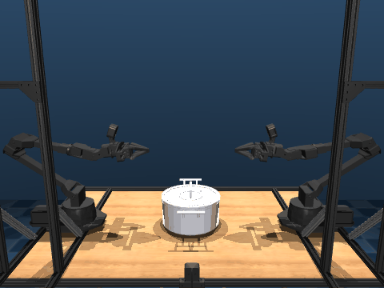

# Aloha Pot Benchmark

## Description

Bimanual manipulation benchmark featuring two Interbotix VX300s robot arms
performing a coordinated pot-lifting task. The pot is represented by 68
individual collision meshes derived from a PartNet object, stress-testing
**mesh-mesh collision detection using GJK**.

## Model Info

| Property | Value |
|----------|-------|
| Bodies | 26 |
| Joints | 18 |
| DOF (nq/nv) | 24 / 23 |
| Actuators | 14 (position) |
| Geoms | 204 |
| Meshes | 134 |
| Timestep | 0.002s |
| Solver | Newton (elliptic cone) |

## Assets

Mesh and texture assets must be fetched before running — see the
[parent README](../README.md#fetching-assets).

## Ctrl Replay

The `lift_pot.npz` file contains a bimanual pot-lifting control sequence
interpolated from keyframes (2 seconds at dt=0.002). It can be replayed via:

```bash
mjwarp-testspeed aloha_pot --replay benchmarks/aloha_pot/lift_pot.npz
```

## Visualization

The `rollout_gif.py` script visualizes control noise robustness by overlapping
N transparent rollouts in a single scene:

```bash
MUJOCO_GL=egl python benchmarks/aloha_pot/rollout_gif.py lift_pot.npz --nworld 64

# With custom noise and camera
MUJOCO_GL=egl python benchmarks/aloha_pot/rollout_gif.py lift_pot.npz --noise 0.1 --camera collaborator_pov
```

The reference robot (world 0) renders fully opaque with zero noise; remaining
robots use semi-transparent "ghost" materials to show trajectory divergence.



## Files

| File | Description |
|------|-------------|
| `scene.xml` | Full scene with two arms, table, and pot |
| `lift_pot.npz` | Ctrl sequence from keyframe interpolation (2s) |
| `rollout_gif.py` | Overlap visualization script |
| `rollout.gif` | 64-world overlap visualization |
