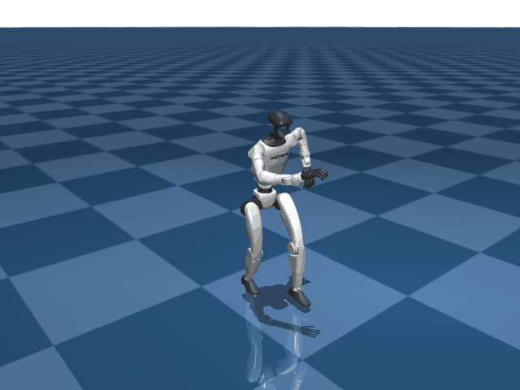
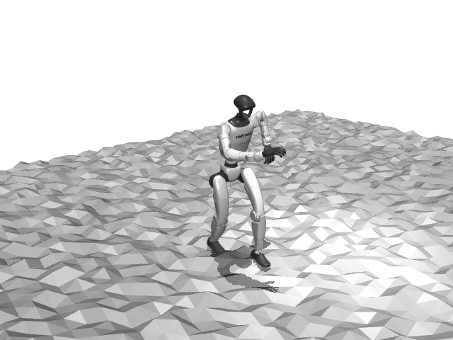

# Unitree G1 Benchmark

## Description

Full-body humanoid locomotion benchmark using the Unitree G1 (29 DOF) with
capsule-based collision geometry. Designed to benchmark **contact-rich
locomotion** with simulation settings matching those used for training in
[mjlab](https://github.com/mujocolab/mjlab). Two scene variants test
performance on flat terrain and randomized heightfield terrain.

## Model Info

| Property | Value |
|----------|-------|
| Bodies | 31 |
| Joints | 30 |
| DOF (nq/nv) | 36 / 35 |
| Actuators | 29 (position) |
| Geoms | 69 (capsules) |
| Meshes | 35 |
| Timestep | 0.005s |
| Solver | Newton (pyramidal cone) |

## Scenes

- **scene_flat.xml** — flat ground plane
- **scene_hfield.xml** — random uniform heightfield terrain

## Assets

Mesh assets must be fetched before running — see the
[parent README](../README.md#fetching-assets).

## Derivation

The robot XML (`unitree_g1_mjlab.xml`) is derived from mjlab's internal
`g1.xml` (`asset_zoo/robots/unitree_g1/xmls/g1.xml`), not directly from
menagerie. Key parameters are baked in to match mjlab's compiled model:

- **Solver**: `timestep=0.005`, `iterations=10`, `ls_iterations=20`,
  `integrator=implicitfast`, `eulerdamp=disable`
- **Armature**: per-joint values computed from motor specs in
  `g1_constants.py` (via `reflected_inertia_from_two_stage_planetary`)
- **Actuators**: per-actuator `kp`/`kv`/`ctrlrange`/`forcerange` from mjlab's
  `BuiltinPositionActuatorCfg`, with actuator ordering matching mjlab
- **Contacts**: geom-level contact properties (no explicit `<pair>` elements):
  - `foot_capsule`: `condim=3`, `friction=0.6`, `priority=1`
  - `collision` class: `condim=1`, `contype=1`, `conaffinity=1`
- **Heightfield**: matches mjlab's `HfRandomUniformTerrainCfg` parameters

## Ctrl Replay

The `shuffle_dance.npz` file contains a walking control sequence captured from
mjlab's trained tracking policy (5 seconds at 50 Hz = 250 RL steps). It can
be replayed via:

```bash
mjwarp-testspeed unitree_g1_flat --replay benchmarks/unitree_g1/shuffle_dance.npz
```

## Visualization

The `rollout_gif.py` script visualizes control noise robustness by overlapping
N transparent robot rollouts in a single scene:

```bash
# 32 robots, noise σ=0.01, flat terrain
MUJOCO_GL=egl python benchmarks/unitree_g1/rollout_gif.py clip.npz

# On heightfield terrain with more worlds
MUJOCO_GL=egl python benchmarks/unitree_g1/rollout_gif.py clip.npz --nworld 64 --terrain hfield

# Custom ghost alpha
MUJOCO_GL=egl python benchmarks/unitree_g1/rollout_gif.py clip.npz --alpha 0.1 -o output.gif
```

The reference robot (world 0) renders fully opaque with zero noise; remaining
robots use semi-transparent "ghost" materials to show trajectory divergence.

| Flat terrain | Heightfield terrain |
|:---:|:---:|
|  |  |

## Files

| File | Description |
|------|-------------|
| `unitree_g1_mjlab.xml` | Robot model (derived from mjlab's g1.xml) |
| `scene_flat.xml` | Flat ground scene |
| `scene_hfield.xml` | Heightfield terrain scene |
| `hfield.png` | Terrain heightfield data |
| `shuffle_dance.npz` | Captured ctrl sequence (250 RL steps) |
| `rollout_gif.py` | Overlap visualization script |
| `rollout_flat.gif` | Overlap visualization on flat terrain |
| `rollout_hfield.gif` | Overlap visualization on heightfield terrain |
| `NOTES.md` | Investigation notes on model alignment |
